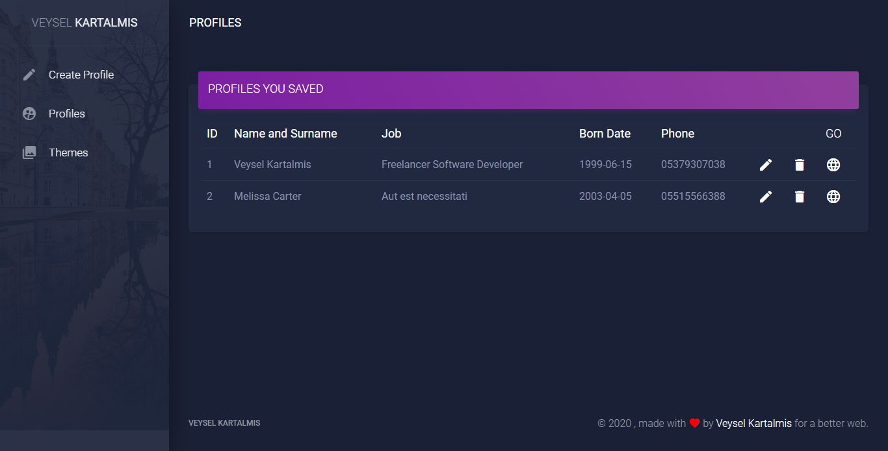
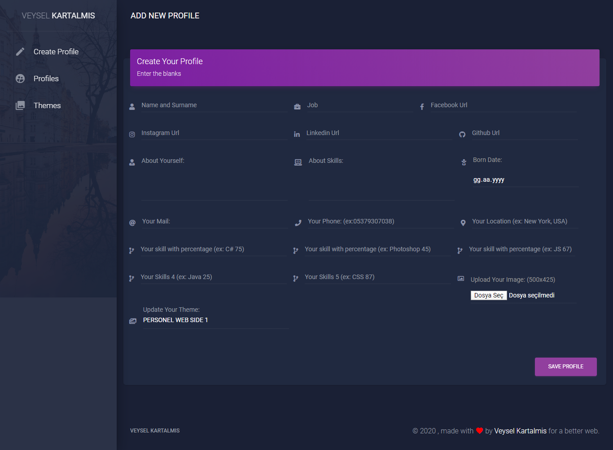

<h1>CREATE YOUR PERSONAL WEB SIDE</h1>
 

 

 
<h3>VIDEO:</h3>

<iframe width="560" height="315" src="https://www.youtube-nocookie.com/embed/JVKHBnAU24A?controls=0" frameborder="0" allow="accelerometer; autoplay; encrypted-media; gyroscope; picture-in-picture" allowfullscreen></iframe>

Instagram : <a href="https://www.instagram.com/veyselkartalmis/">@veyselkartalmis</a>

## License

The Laravel framework is open-sourced software licensed under the [MIT license](https://opensource.org/licenses/MIT).
